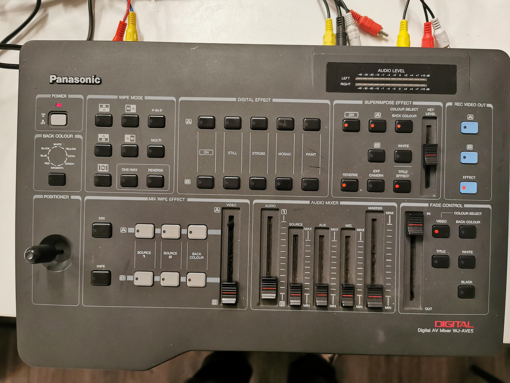
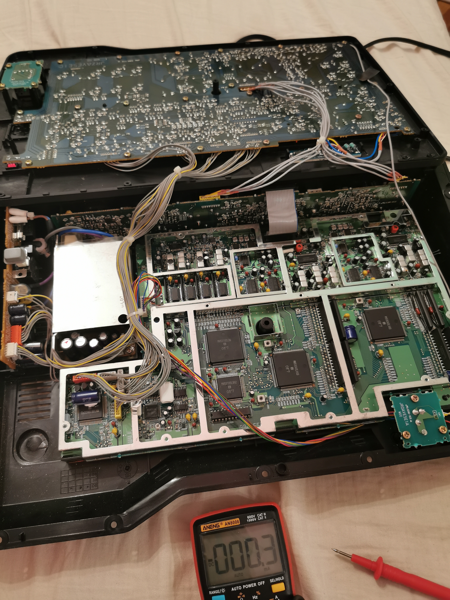
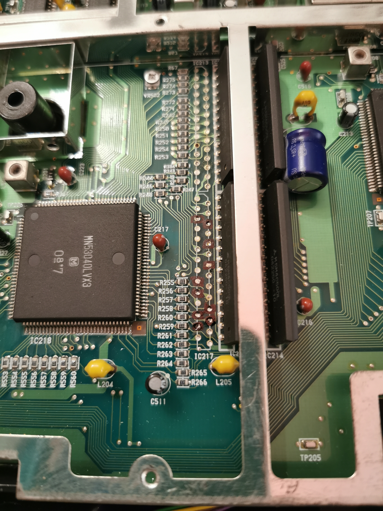
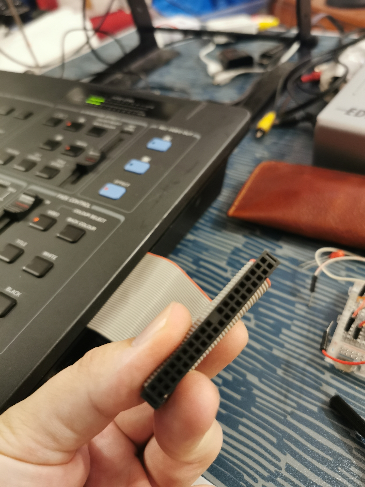
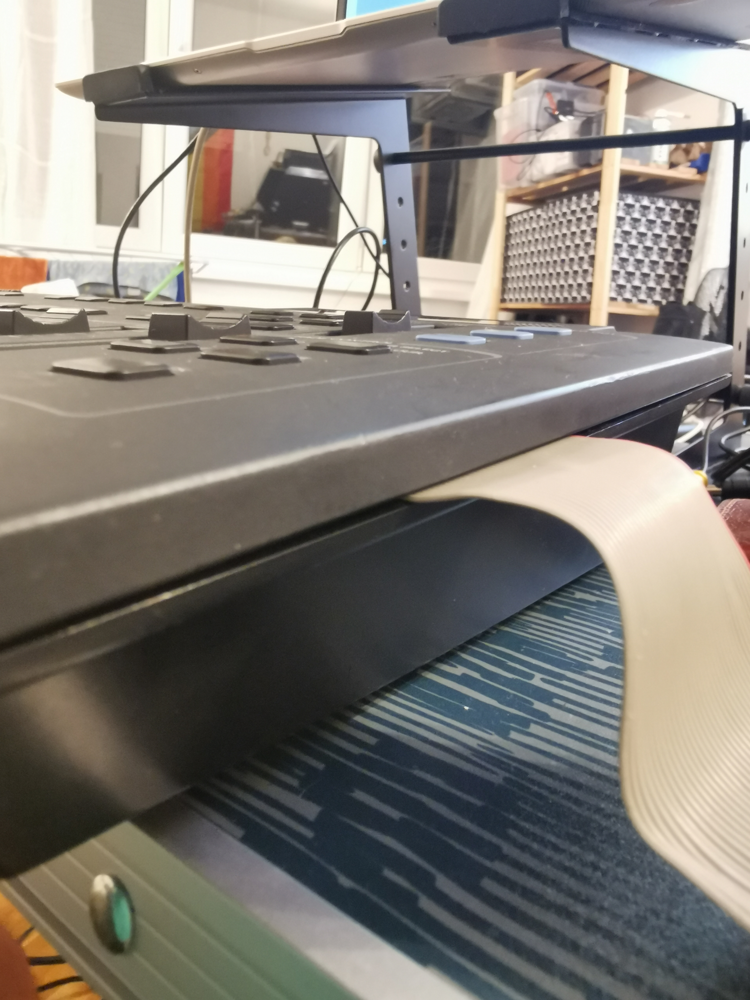
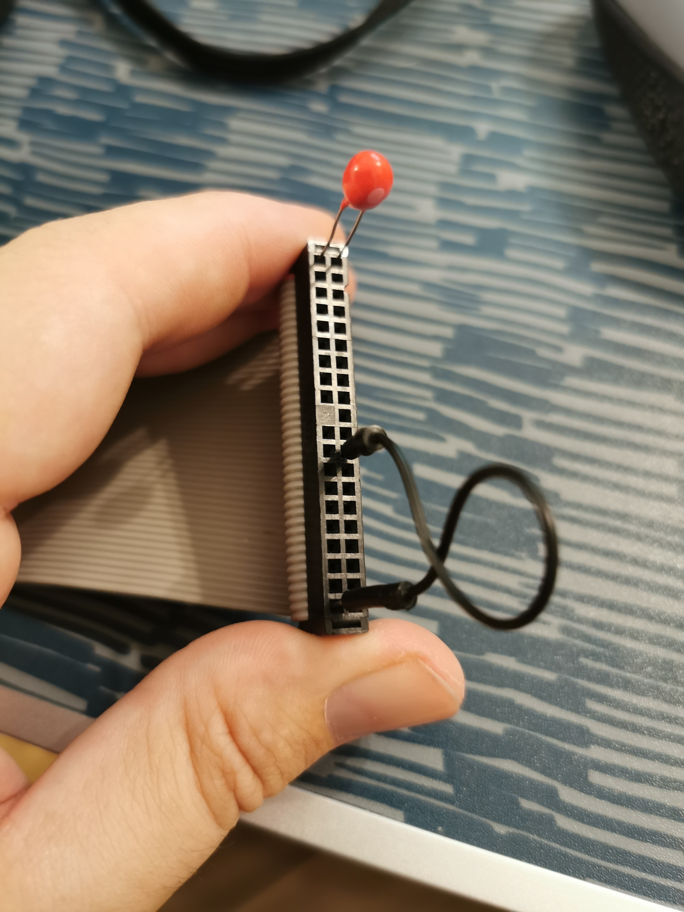
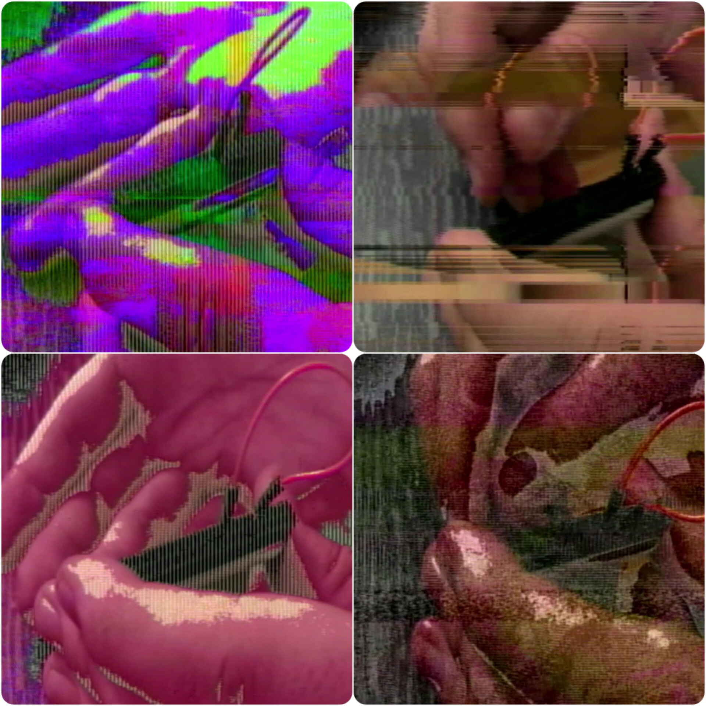

# Panasonic-AVE-5-circuit-bend
A more comprehensive documentation of various circuit bends on Panasonic WJ-AVE5 video mixer.

## How it started
When I was a kid in the 1990s, I got fascinated by TV and as we had a camera at home, I started making my own TV shows and various experiments with in-camera VFX, but I craved a video mixer, to be able to do some keying and cool wipes and stuff. In 2023, an idea popped into my head to try to find one of these old video mixers. I looked on a local "Craigslist" type of website and there it was, Panasonic AVE5. I immediately ordered it. It was in perfect condition. Then I searched for some documentation and found out that it can be circuit bent to do all sorts of cool glitches. This was the Karl Klomp mod, and I also found Tarcisio Drusin's (Pancra85) contribution to this mod on [Circuit Benders forum](circuitbenders.co.uk). Now, unfortunately, Karl Klomp's website is broken and I couldn't find the original mod, so I decided to do my own experiments. I saw Tarcisio used some memory pins, but there was a lot of pins they didn't use, so I decided to poke around with a multimeter set to measure milliamps, to short these pins to ground or short them together, to see what happens (and also looking at the current, to know if shorting these pins is unhealthy for the electronics - basically anything above 15mA can fry your chips). I quickly found out that there are way more pins to circuit bend than I thought, so I decided to take an old IDE ribbon cable, solder 20 wires to pins that reacted to my poking, and make a nice breakout cable outside of the mixer.

The mod I found on Circuit Benders forum:

## Photos

Here are some images:

Inside:

I marked the memory pins that Tarcisio used, but I also found out that other pins have interesting glitches as well.

I decided to circuit bend only the B-bus, since I will probably want to mix between clean and glitchy. Here is the soldered ribbon cable:

And this is the breakout. The great thing is that you can connect the pins using a simple jumper wire. I also made sure to include a GND connection on the breakout.

There is enough space for the cable that you don't need to cut the case. Just don't tighten the screws all the way!

## Audio reactive wipe

Karl Klomp apparently made an audio reactive wipe by connecting pin 14 on IC224 to audio input. I did this and got absolutely nothing. Then I looked at the schematics in the service manual ([you can find the AVE5 service manual here](manuals/)) and found out that IC224 isn't really controlling the wipe. I looked for the mix potentiometer connection, and found one on the "switch board" (this is the PCB where all the buttons and pots are located). The E2 connector has a pin that's directly connected to the mix potentiometer, it's pin 5 (when you turn the board so you can read E2 correctly, you start counting from left to right, or if you have it upside down like me, it's the 3rd pin from the left. See photo or service manual). Now, instead of connecting this to audio input, as suggested by Tarcisio, I connected it to the audio output, so I can use the audio mixer to control the volume (which will be the amount of modulation to the wipe). Of course, you need to connect it over a decoupling capacitor, to prevent DC bias from the pot entering the audio circuitry. I decided to just put both the audio output and the mix pot pin to the breakout cable, so I can just bridge the connection with a capacitor or use some LFO's with a CV.

## Exploring the glitches

I wanted to do this scientifically, by trying all the possible combinations and documenting the glitches with screenshots. I first tried connecting every pin to ground, and then I tried combinations of two pins - pin 1 and 2, pin 1 and 3, pin 1 and 4, and so on. Then pin 2 and 3, pin 2 and 4, pin 2 and 5... I tried 210 different combinations and found some really interesting effects that you can find in the folder named "[glitch screenshots](glitch%20screenshots/)". The filename is the pin numbers on my breakout (not the same as the actual pin numbers on the IC). I number the pins differently. Here is the table for conversion:

| My pin number | Actual pin number |
| ------------- | ----------------- |
| 0             | ground            |
| 1             | 2                 |
| 2             | 3                 |
| 3             | 4                 |
| 4             | 5                 |
| 5             | 6                 |
| 6             | 7                 |
| 7             | 8                 |
| 8             | 9                 |
| 9             | 10                |
| 10            | 12                |
| 11            | 13                |
| 12            | 17                |
| 13            | 18                |
| 14            | 19                |
| 15            | 22                |
| 16            | 23                |
| 17            | 24                |
| 18            | 25                |
| 19            | 26                |
| 20            | 28                |

## Final thoughts

I believe this is, at the time of writing, the most detailed documentation of the Panasonic AVE-5 mod and the glitches you can get with it. I will be expanding it as I discover new stuff. Feel free to contribute as well! :D
A lot of interesting visuals can be made by using internal feedback - plugging one of the outputs into an input. You can then mix them with a simple dissolve or using a wipe. Use Fade control to reduce the amount of feedback, this is very important as feedback easily gets overblown, and you just get a white screen.

